# Prokon ERP — How the System Works (Diagrams)

> **How to read these diagrams**
> - A **box** is a thing (a screen, a file, a database table).
> - A **diamond** is a question or a check ("Is X true?").
> - An arrow shows what happens next. **❌ = stops with an error**, **✅ = success**.
> - Every diagram starts with a one-line *"In plain words"* summary.
> - Technical names are kept in brackets `(like_this)` so you can find them in the code.
>
> These diagrams match the system after the bug-fix hardening pass
> (`BUG_REPORT.md` items B-01…B-26 + SQL migration `20260823100000_bugfix_hardening.sql`).

---

# PART 1 — THE BIG PICTURE

## 1.1 The whole system on one page

*In plain words:* Staff use a website. The website talks to one central database.
Rules that protect money and stock live **inside the database**, not just on screens.

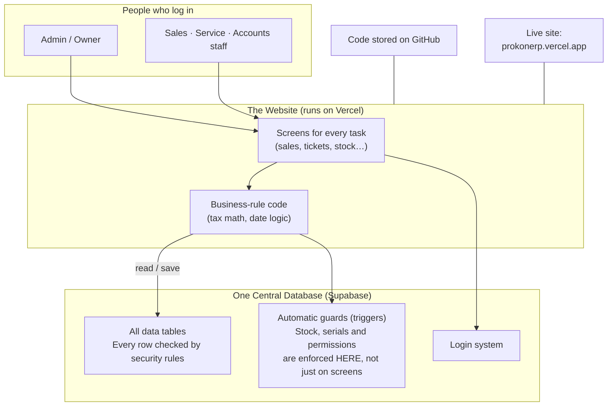

## 1.2 The modules and how they connect

*In plain words:* A sale starts as a Quotation and flows step-by-step until it becomes an
Invoice. Goods in/out always pass through the Stock tables, which keep a full history.

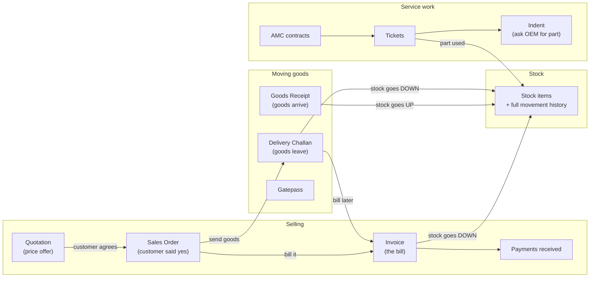

---

# PART 2 — STEP-BY-STEP FLOWS

## 2.1 Turning a Quotation into an Invoice (safely)

*In plain words:* Each conversion step first checks *"was this already done?"*
If yes, it opens the existing document. Double-clicking can never create duplicates.

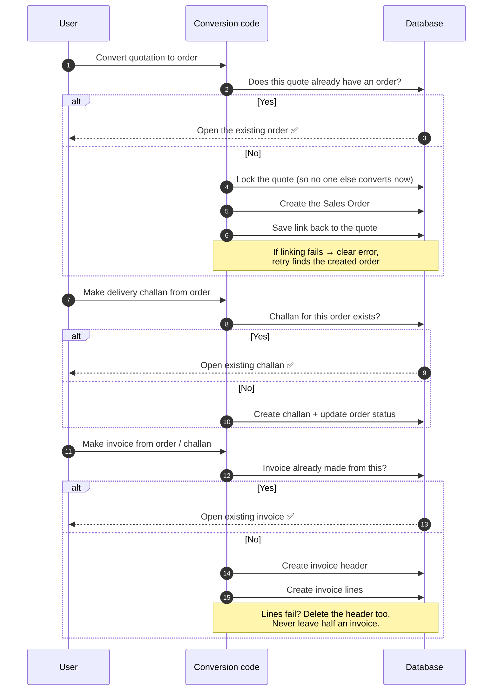

## 2.2 What happens when someone saves an Invoice

*In plain words:* Before saving, the app checks quantities and serial numbers.
While saving, the database checks stock and permissions again. Anything wrong
stops the save with a clear message — nothing fails silently.

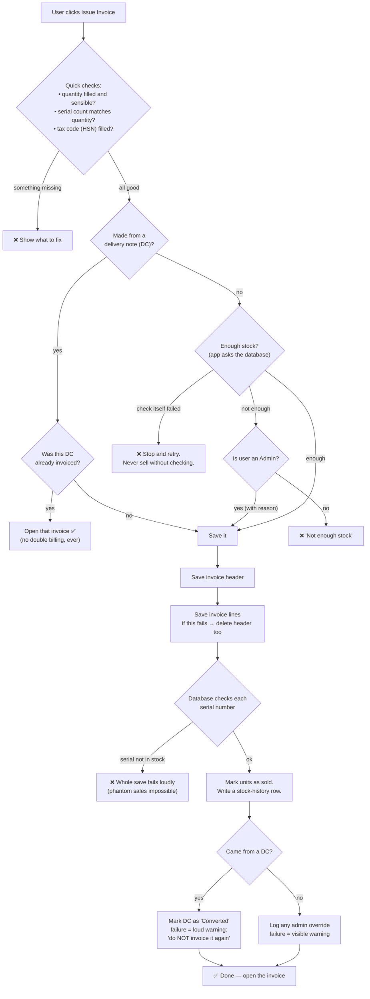

## 2.3 Every way stock can change

*In plain words:* Stock never changes secretly. Only these events move it,
and every single movement writes a history row. App code cannot bypass this.

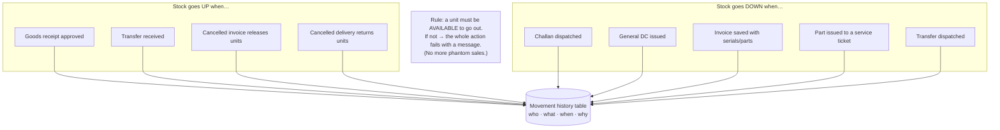

### Life of one serial-numbered unit

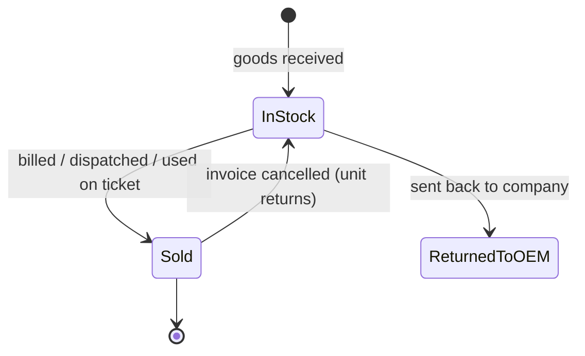

## 2.4 Money rules

### Recording a payment

*In plain words:* A payment can only be spread across bills up to what each bill
actually owes — checked twice: once on screen, once against fresh data at save time.

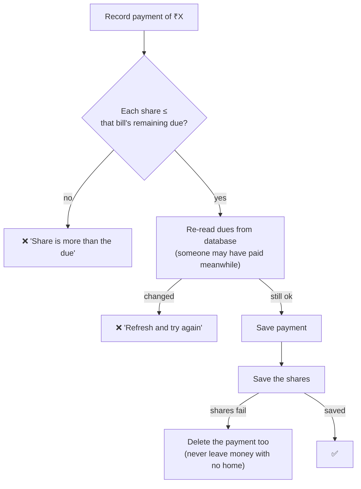

### Tax (GST) totals — always matching

*In plain words:* The discount at the bottom of an invoice is spread across the
line items using exact paisa math. Screen, printout, saved rows and tax filing
all show the same numbers. Same-state vs other-state tax is decided ONE way:
by comparing GSTIN codes (with state name as backup).

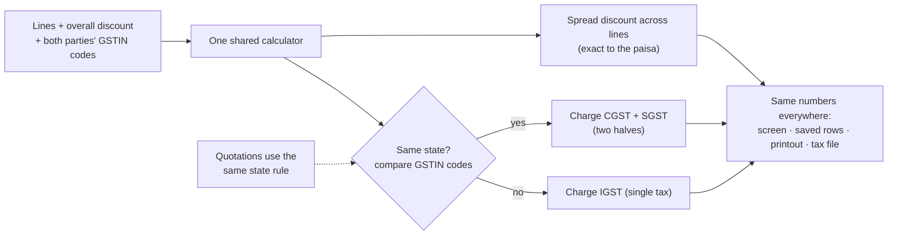

## 2.5 Salary month cycle

*In plain words:* Attendance is saved together with its audit record. If the audit
fails, the attendance changes are undone automatically — payroll history can
never go missing. Salary math has automated tests.

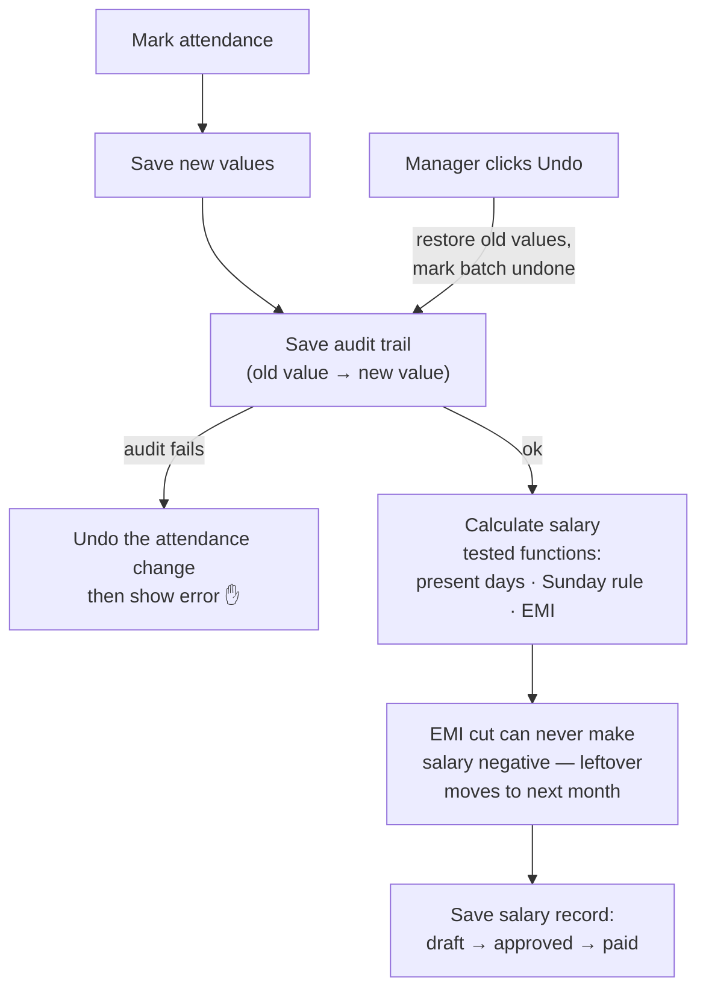

## 2.6 Who is allowed to do what

*In plain words:* Screens hide things, but the database decides. Even if someone
bypasses a screen, the database refuses anything their role doesn't allow.

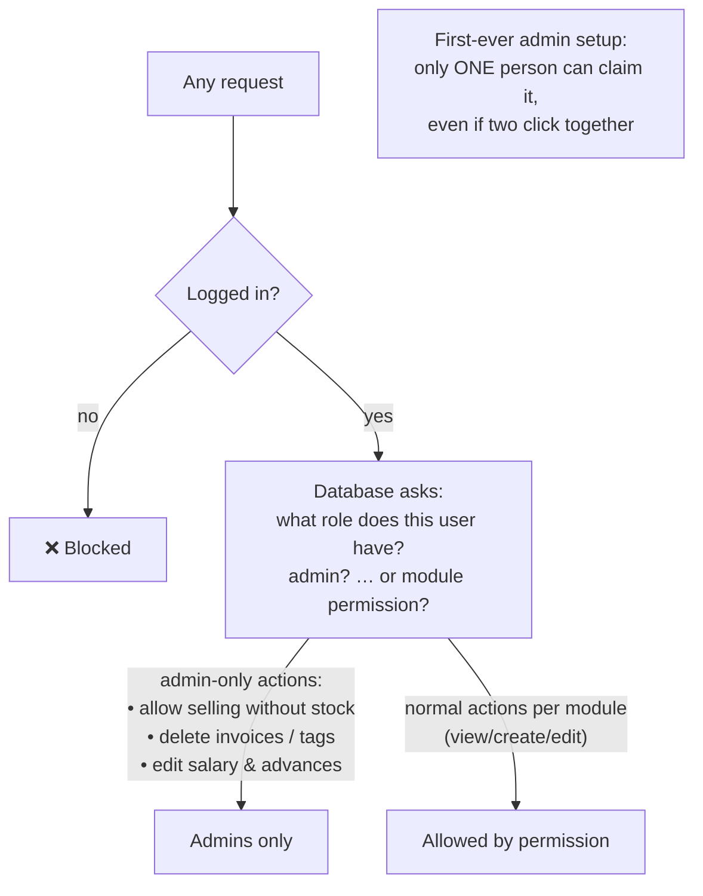

## 2.7 Dates always follow Indian time

*In plain words:* All document dates use Indian Standard Time, so a bill made at
1 AM is dated today, not yesterday. SLA clocks treat Sundays by the Indian calendar,
so everyone sees the same numbers.

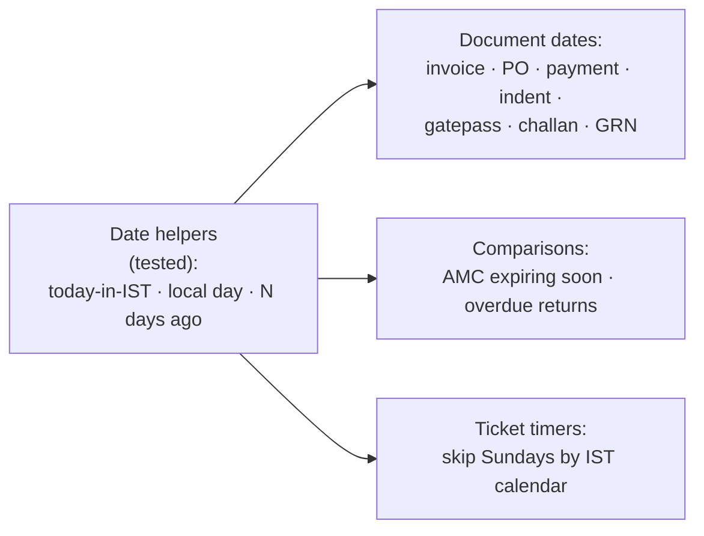

## 2.8 Main tables and how they relate

*In plain words:* Each document links to the one it came from, so you can always
trace: which quotation became this invoice, and where the money was applied.

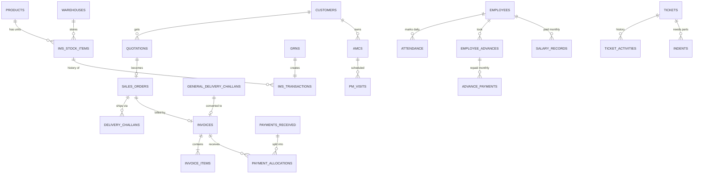

## 2.9 What changed in the bug-fix pass (quick reference)

| Situation | Before | Now |
|---|---|---|
| Saving fails halfway through a bill | Half-saved records stayed | Everything rolled back |
| Same delivery billed twice | Possible | Impossible — retry opens the original |
| Selling units not in stock | Sometimes silent | Always blocked with a message |
| Bill made 1–5:30 AM | Dated yesterday | Correct IST date |
| Lists longer than 1000 rows | Quietly cut off | Fully loaded |
| Errors behind the scenes | Hidden | Shown with clear next-step |
| Two people editing/approving at once | Both succeeded | Last-one-wins is detected |

---

## Appendix: Where things live (for engineers)

| Concern | File(s) |
|---|---|
| Pure GST/discount engine | `src/lib/gst.ts` |
| Document mapping (pure) | `src/lib/documentFlow.ts` |
| Document writers (guarded) | `src/lib/documentFlow.writers.ts` |
| IST date helpers | `src/lib/dateRange.ts` |
| Shared same-state rule | `src/lib/crm.ts → isIntraSupply()` |
| Ticket stock issue (claim-first) | `src/lib/ims.ts → issueStockToTicket()` |
| Full-list loading helper | `src/lib/fetchAll.ts → fetchAllWith()` |
| SLA hours (IST Sundays) | `src/lib/tickets.ts → hoursExcludingSundays()` |
| Payroll math (tested) | `src/lib/payroll.ts` |
| Database hardening SQL | `supabase/migrations/20260823100000_bugfix_hardening.sql` |
| Test suite (68 tests) | `src/lib/__tests__/*.test.ts` |
